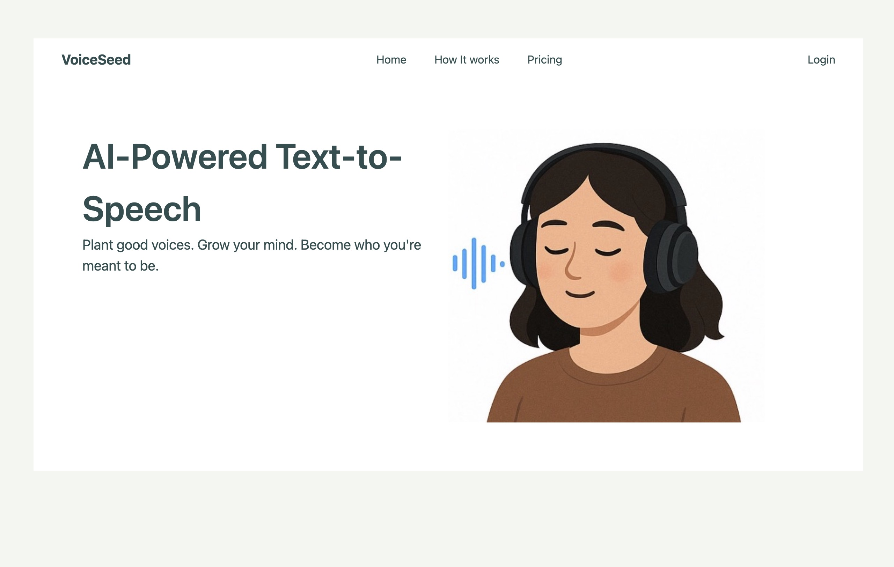
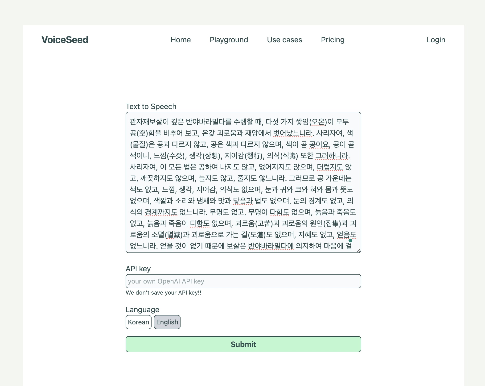

# Devlog

## 2025-04-17, develop draft ui of homepage

The homepage UI uses a framed layout to create a warm and welcoming atmosphere. The color palette features soft, calming tones—such as gray, light cream white, and brown—enhanced by gentle, charming illustrations.

##

Developing Playground page that user can input text to convert to speech, api key and language selector.

# SeedVoice

VoiceMind is an AI-powered SaaS product that transforms meaningful text into clear and memorable audio.

Whether you're a student reinforcing your learning through audio, or someone seeking mindful reflection through daily quotes and teachings, VoiceMind helps you carry words in your mind and heart.

---

## Features

- Study Audio Generator
  Turn study summaries or class notes into audio books to enhance long-term memory.

- Mindful Quote Narrator
  Input spiritual quotes, mantras, or religious texts to generate calming audio for reflection and meditation.

- Simple Web Interface
  A minimal, intuitive UI for pasting text and downloading audio instantly.

---

## Use Cases

| User Type       | Example Usage                                         |
| --------------- | ----------------------------------------------------- |
| Student         | Create an audio version of a lecture summary          |
| Meditative User | Generate a daily audio quote from Buddha or Rumi      |
| Busy Learner    | Listen to important notes or passages while on the go |

---

## Why VoiceMind?

Because meaningful words aren’t just for reading.
They’re for remembering, reflecting, and experiencing.
Let them echo in your mind—anytime, anywhere.

---

## Contact

For support, questions, or collaborations:
Email: `thursdaycurry@gmail.com`
Website: (coming soon)\_
